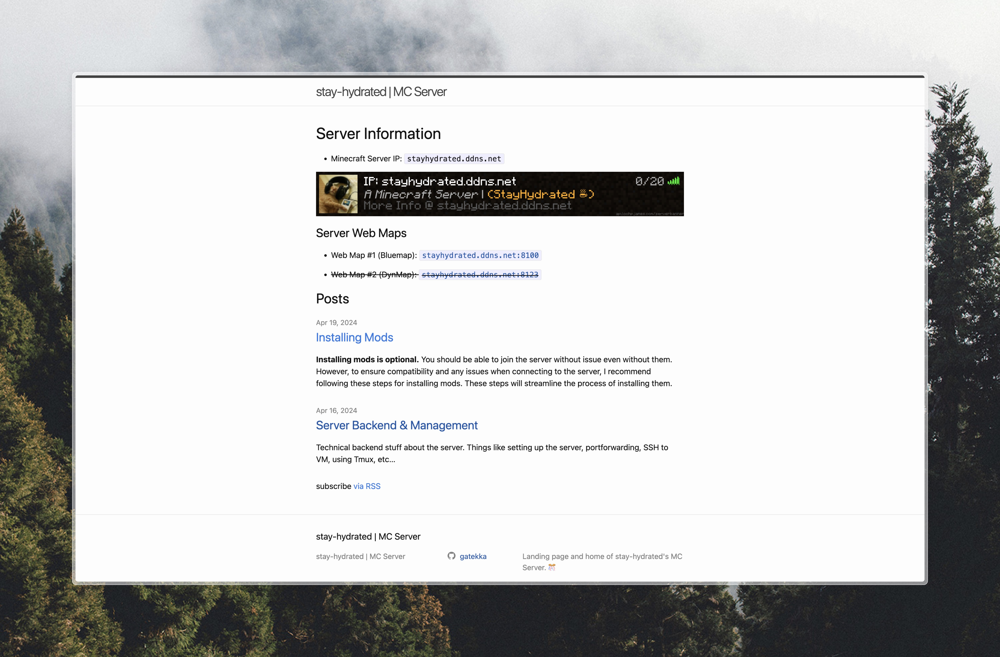

# MC-Server Website

 A personal project to learn more about using Linux via a VM and managing the server's backend.

Serves as a landing page for a MC Server I'm running that contains guides on how to connect with mods, and more info about the server.

